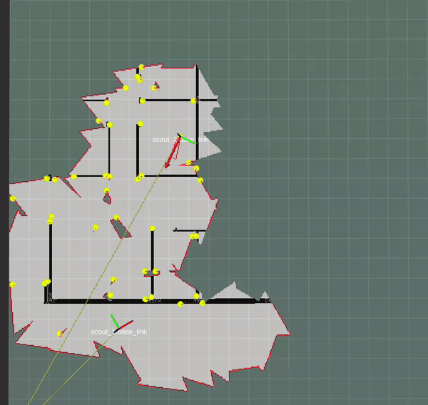

# A 2D exploration simulator that works with ROS 2.

Simulates multiple robots in pre-defined 2D exploration grid image. The robots explore the world upon recieving exploration poses via a ROS 2 action.
Currently, the action tries to mimick the Nav2 ```navigate_to_pose``` action server. In a future release, a custom action will be added.


